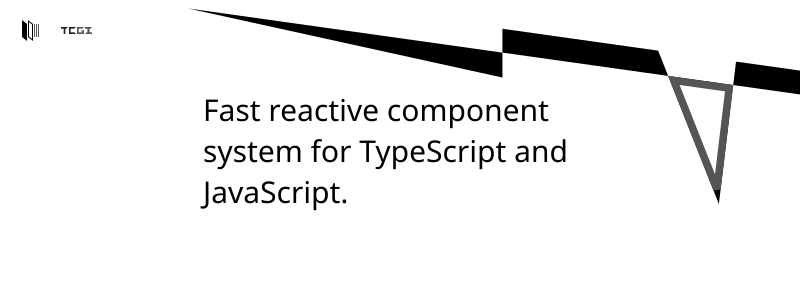

TCGI allows you to create graphical interfaces with javascript or typescript without other external dependencies and common performance drawbacks. Unlike react, TCGI does not need a compile step, another programming language, or tediouis layout management. All components are provided and can be reused to create highly complex components for a variety of situations.

# Basic Usage Example
```ts
// Initialize root of UI interface
setup_ui(document.body);

// Setup interface settings
root.set_settings({
    mode: Mode.Explicit,
    value: x0_settings
});

{
    // Create reload button
    const button = Button.construct();
    const label = Label.construct();

    // Set properties
    label.set_text("Reload");
    label.set_description("Reload this webpage with location.reload()");

    // Setup button
    button.addEventListener("click", () => {
        if (confirm("Are you sure you want to reload this application? Written storage will not be erased.")) {
            location.reload();
        }
    });

    button.set_label(label);
    root.appendChild(button);
}
```

# Installation
```bash
npm install tcgi
```